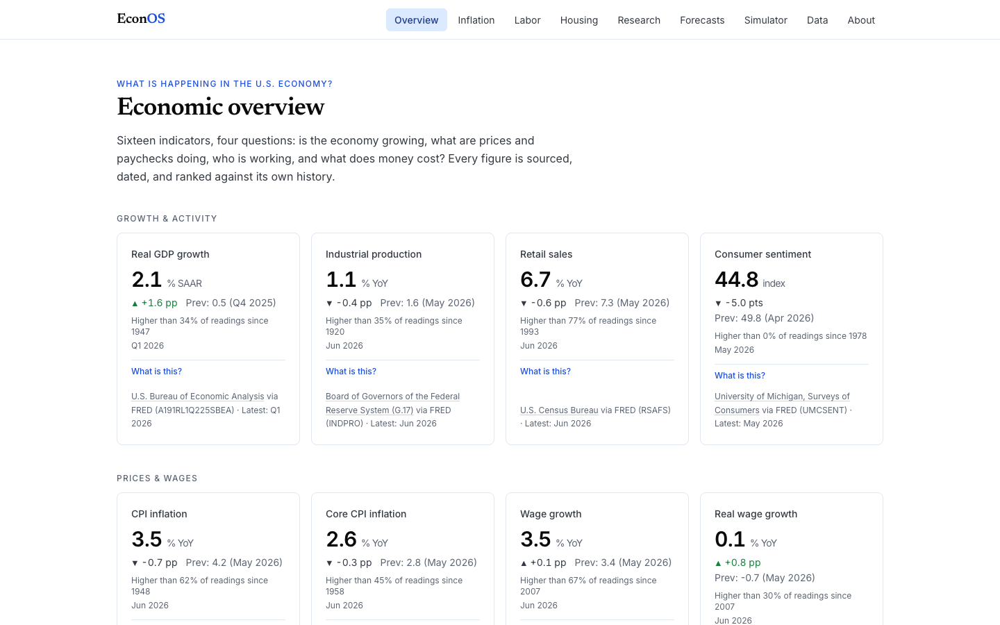
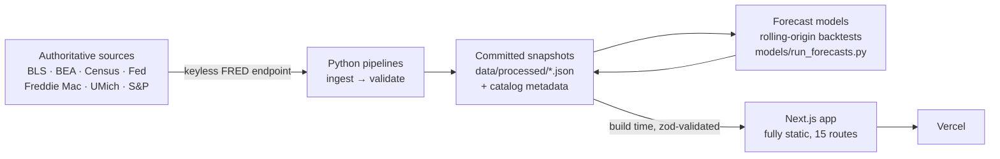
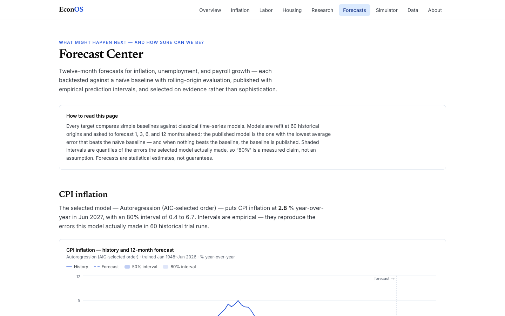
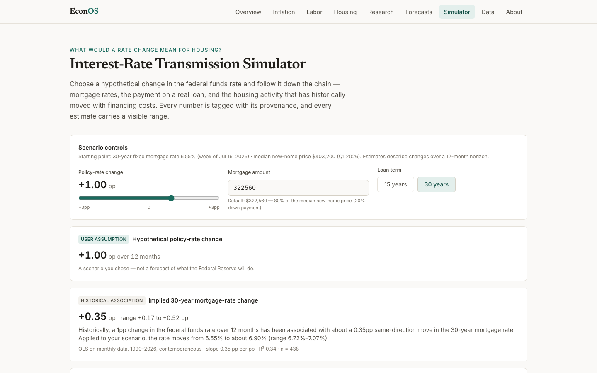

# EconOS

**An economic intelligence platform that connects macroeconomic forces to the real-world outcomes experienced by households, workers, businesses, and regions.**

[](https://github.com/jsaintfleur/EconOS/actions/workflows/ci.yml)
[](LICENSE)
[](https://nextjs.org)
[](apps/web/tsconfig.json)
[](pipelines/)

**Live application: [econos-sooty.vercel.app](https://econos-sooty.vercel.app)**



---

## What EconOS does

Inflation, interest rates, employment, and housing shape every paycheck, mortgage, and grocery bill. EconOS traces those forces from headline statistics down to what they mean for real people — with sourced data, visible uncertainty, and methods you can check. Every page answers a concrete economic question:

| Layer | Question | Where |
| --- | --- | --- |
| **Economic Observatory** | What is happening, what changed, how unusual is it? | [Overview](https://econos-sooty.vercel.app/overview) · [Inflation](https://econos-sooty.vercel.app/inflation) · [Labor](https://econos-sooty.vercel.app/labor) · [Housing](https://econos-sooty.vercel.app/housing) |
| **Microeconomic Impact Lab** | Who is affected, and by how much? | Purchasing-power & mortgage calculators, Housing Affordability Index |
| **Economic Research Lab** | What does theory say — and does the data agree? | [Real wages](https://econos-sooty.vercel.app/research/real-wages) · [Okun's Law](https://econos-sooty.vercel.app/research/okuns-law) · [Beveridge Curve](https://econos-sooty.vercel.app/research/beveridge-curve) · [Rate transmission](https://econos-sooty.vercel.app/research/rate-transmission) |
| **Forecast Center** | What might happen next, and how sure can we be? | [Forecasts](https://econos-sooty.vercel.app/forecasts) — inflation, unemployment, payrolls |
| **Transmission Engine** | What would a rate change mean for housing? | [Simulator](https://econos-sooty.vercel.app/simulator) |

## Why it's built the way it is

EconOS treats analytical honesty as a product feature:

- **Every number is traceable.** Each metric shows its originating agency, series identifier, unit, seasonal adjustment, and observation date. The [Data & Methods center](https://econos-sooty.vercel.app/data) catalogs all 35 series with licenses and known limitations.
- **Uncertainty is visible, and selection is evidence-based.** Forecasts carry empirical 50%/80% prediction intervals derived from 60-origin rolling backtests. Where no model beats the naïve baseline — true for unemployment and payroll growth — the baseline is published and labeled as such, rather than hidden behind a more impressive-sounding model.
- **Correlation is never dressed up as causation.** The rate-transmission simulator tags every output as a *user assumption*, *direct calculation*, or *historical association* — and flags near-zero-R² associations as near-uninformative.
- **No fabricated data, ever.** A failed source refresh preserves the last validated snapshot and marks it stale in the UI. Validation gates (schema, date continuity, plausible ranges) run in CI and block bad data from shipping.
- **Interpretation is disciplined.** No mechanical green-good/red-bad coloring: rates, yields, and inflation readings are presented neutrally, with color reserved for changes whose welfare interpretation is unambiguous.

## Architecture



There is no runtime database and no request-time data fetching: sources are ingested on a schedule, validated, committed as compact JSON snapshots, and compiled into statically generated pages. `git log -- data/processed/` **is** the data lineage, and a weekly GitHub Action refreshes data through reviewable pull requests. Full rationale in [docs/architecture.md](docs/architecture.md).

### Repository layout

```
apps/web/          Next.js 16 (App Router) · strict TypeScript · Tailwind v4 · Recharts · Zod
pipelines/         Python ingestion (keyless FRED) and validation gates
models/            Forecast generation with rolling-origin backtesting (statsmodels)
data/metadata/     Series registry — governance metadata for all 35 series
data/processed/    Validated JSON snapshots + forecast artifacts (committed)
docs/              Product requirements, methodology, architecture, design system
.github/           CI (lint · typecheck · test · build · validate · audit) + scheduled refresh
```

## Screenshots

| Forecast Center | Rate-Transmission Simulator |
| --- | --- |
|  |  |

## Getting started

Requires Node.js 20.9+ and Python 3.11+.

```bash
git clone https://github.com/jsaintfleur/EconOS.git
cd EconOS

# Web application (committed snapshots included — no API keys needed)
cd apps/web
npm install
npm run dev            # http://localhost:3000

# Refresh data and regenerate forecasts (optional)
python3 pipelines/ingest/fetch_fred.py
python3 pipelines/validate/validate_processed.py
pip install numpy statsmodels
python3 models/run_forecasts.py
```

## Quality gates

All of the following run in CI on every push and pull request:

```bash
cd apps/web
npm run lint           # ESLint
npm run typecheck      # strict TypeScript
npm test               # Vitest — economic calculations and components
npm run build          # production build (all routes statically generated)
python3 pipelines/validate/validate_processed.py   # data contract validation
```

The test suite covers the economic calculation library (growth rates, real values, mortgage amortization, affordability-index boundary behavior, percentile ranks, OLS) — including a regression test ensuring year-over-year windows are matched by calendar date rather than silently stretched across missing releases.

## Methodology

Definitions, formulas, transformation rules, index construction, and causal-language policy are documented in [docs/economic-methodology.md](docs/economic-methodology.md); the forecasting protocol (model families, rolling-origin evaluation, interval construction, selection rules) in [docs/forecasting-methodology.md](docs/forecasting-methodology.md); and the simulator's provenance-label taxonomy in [docs/scenario-engine.md](docs/scenario-engine.md).

## Roadmap

Tracked in [docs/backlog.md](docs/backlog.md). Highlights: regional comparison module (state/metro map), Economic Momentum and Household Pressure composite indices, Playwright end-to-end smoke tests, per-chart data-table alternatives, and direct BLS/BEA API ingestion.

## Author

**Jean-Luc Saint-Fleur** — economist by academic training; data and analytics professional; community development practitioner; builds data products end to end.

- GitHub: [@jsaintfleur](https://github.com/jsaintfleur)
- Project: [github.com/jsaintfleur/EconOS](https://github.com/jsaintfleur/EconOS)

## License & disclaimer

Released under the [MIT License](LICENSE).

> EconOS is an educational and analytical product. It does not provide financial or investment advice. Forecasts are statistical estimates, not guarantees. Data are drawn from authoritative public sources via Federal Reserve Economic Data (FRED); errors and omissions are the author's own.
